# Living Me 機能要件定義書

**最終更新**: 2026-03-30
**対象読者**: 初心者・非エンジニア
**バージョン**: v2.0
**プロジェクト名**: Living Me ～本当の自分と出逢う会～

---

> **このドキュメントの読み方**
> 技術的な言葉が出てきたときは、直後のカッコ内に日本語の説明を書いています。
> 難しいと感じたら読み飛ばしてもかまいません。
> 図や表を中心に眺めるだけでも全体像を把握できます。

---

## 目次

1. [サービス概要](#1-サービス概要)
2. [会員種別](#2-会員種別)
3. [サービス全体の構造](#3-サービス全体の構造)
4. [会員向け機能](#4-会員向け機能)
5. [管理者向け機能](#5-管理者向け機能)
6. [公開ページ（ログイン不要）](#6-公開ページログイン不要)
7. [データモデル（情報の設計図）](#7-データモデル情報の設計図)
8. [技術選定](#8-技術選定)
9. [セキュリティ](#9-セキュリティ)
10. [非機能要件](#10-非機能要件)

---

## 1. サービス概要

### 1.1 サービス情報

| 項目 | 内容 |
|------|------|
| サービス名 | Living Me ～本当の自分と出逢う会～ |
| サイト種別 | 会員制コミュニティポータルサイト |
| コンセプト | 愛のある心の居場所 |
| キャッチフレーズ | 「頑張るよりも整える」「変わるよりも思い出す」 |
| 想定会員数（開始時） | 約 40名 |
| 想定会員数（半年後） | 約 150名 |
| 想定会員数（将来） | 3,000〜5,000名 |

### 1.2 サービスの目的

Living Me は、日々の喧噪の中で**本当の自分**を見失いがちな人たちが、安心して集まれる「心の居場所」を提供するコミュニティサービスです。

- コミュニティの情報を一か所にまとめて管理する
- 世界観・ブランドを統一した体験を届ける
- 会員同士のつながりを育てる
- 会員満足度と継続率を高める

### 1.3 サービス成長イメージ

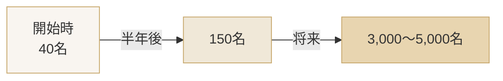

---

## 2. 会員種別

Living Me には 5 種類のユーザーがいます。

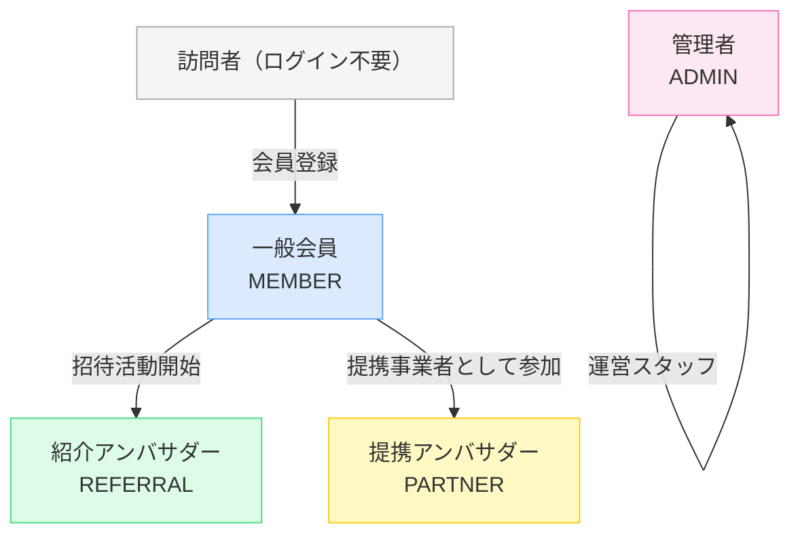

| 種別 | ロール名 | 月額料金 | 説明 |
|------|----------|----------|------|
| 一般会員 | MEMBER | 3,300円/月 | 標準の有料会員。コミュニティのすべての機能を利用できる |
| 紹介アンバサダー | REFERRAL | 4,300円/月 | 紹介活動を行うアンバサダー会員。専用の紹介リンクを持つ |
| 提携アンバサダー | PARTNER | 9,900円/月 | 提携事業者として参加するアンバサダー会員 |
| 管理者 | ADMIN | — | 運営スタッフ。すべての管理機能を操作できる |
| 未ログインユーザー | — | — | LP（紹介ページ）とお問い合わせフォームのみ閲覧可能 |

> **アンバサダー（Ambassador）とは？**
> 新しい会員を紹介してくれる方のことです。紹介した人数に応じて報酬が発生します。

---

## 3. サービス全体の構造

### 3.1 ページ構成と権限の全体像

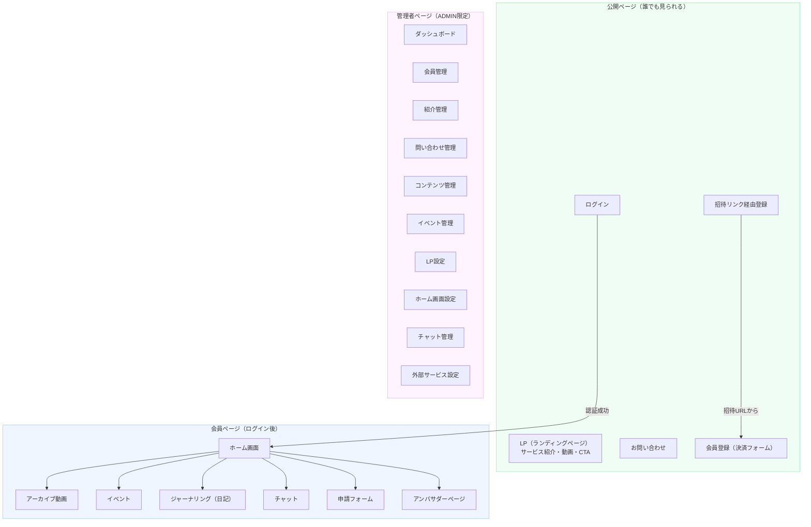

### 3.2 ログインから機能利用までの流れ

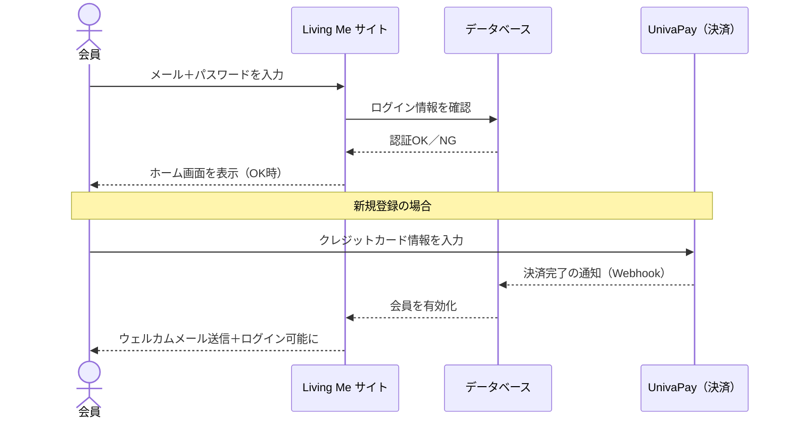

---

## 4. 会員向け機能

### 4.1 機能一覧

| # | 機能名 | 概要 | 利用可能なロール |
|---|--------|------|----------------|
| 1 | ホーム画面 | 今日のテーマ・ジャーナリングテーマ・アーカイブ・イベント・チャットのまとめ画面 | 全会員 |
| 2 | アーカイブ動画 | 朝会・夜会・イベントの過去動画をカテゴリ・タグで検索して視聴 | 全会員 |
| 3 | イベント | 開催予定のイベントへの参加申込・Zoomリンクの確認 | 全会員 |
| 4 | ジャーナリング | 毎日配信されるテーマに沿って日記を書く機能 | 全会員 |
| 5 | チャット | チャンネル（テーマ別の部屋）・スレッド対応のリアルタイムチャット | 全会員 |
| 6 | 申請フォーム | マヤ暦講座・個人セッションなどの申込フォーム | 全会員 |
| 7 | アンバサダーページ | 紹介リンクの確認・アンバサダー情報の閲覧 | REFERRAL・PARTNER |

### 4.2 ホーム画面

ホーム画面は会員が最初に目にするページです。管理者が設定した表示セクションが表示されます。

**表示できるセクション（管理者が切替可能）**

- 今日のテーマ
- ジャーナリングテーマ
- アーカイブ動画（最新3件）
- 直近のイベント
- チャットのプレビュー

### 4.3 アーカイブ動画

過去に開催した朝会・夜会・イベントの録画動画を視聴できます。

**検索・絞り込み方法**

| 方法 | 説明 |
|------|------|
| カテゴリ検索 | 朝会 / 夜会 / イベント など |
| タグ検索 | 「瞑想」「マヤ暦」など任意のタグ |
| 日付順 | 新しい順・古い順 |

### 4.4 イベント

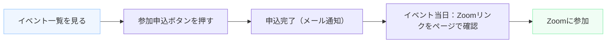

### 4.5 ジャーナリング（日記）

毎日配信されるテーマ（例：「今日、あなたが大切にしたいことは？」）に沿って、自分の気持ちを文章で書き留める機能です。

- 書いた日記は自分だけが閲覧可能（プライベート）
- 過去の日記を一覧で振り返ることができる

### 4.6 チャット

会員同士がリアルタイムでやり取りできます。

| 機能 | 説明 |
|------|------|
| チャンネル | テーマ別の「部屋」。管理者が作成・権限設定 |
| スレッド | 特定の発言に対して返信をまとめる |
| リアルタイム更新 | ページを再読み込みしなくてもメッセージが届く |

### 4.7 アンバサダーページ（REFERRAL・PARTNER 限定）

| 表示内容 | 説明 |
|----------|------|
| 紹介専用リンク | このリンクを友人に送ると紹介実績として記録される |
| 紹介した会員数 | 何人を紹介したかを確認できる |
| 報酬情報 | 紹介報酬の累計（単価は管理者が設定） |

---

## 5. 管理者向け機能

### 5.1 機能一覧

| # | 機能名 | 概要 |
|---|--------|------|
| 1 | ダッシュボード | 会員数・統計サマリーの確認 |
| 2 | 会員管理 | 会員一覧・有効/無効切替・ロール変更・紹介者確認 |
| 3 | 紹介管理 | 紹介実績の確認・報酬計算（単価は設定画面で変更可） |
| 4 | 問い合わせ管理 | 受信一覧・返信送信・ステータス管理 |
| 5 | コンテンツ管理 | 今日のテーマ・アーカイブ動画の編集 |
| 6 | イベント管理 | イベント作成・参加者一覧 |
| 7 | LP設定 | ランディングページの全セクション編集 |
| 8 | ホーム画面設定 | 表示セクションの切替 |
| 9 | チャット管理 | チャンネル作成・ロール別アクセス権設定 |
| 10 | 外部サービス設定 | UnivaPay・Lark・紹介報酬単価の設定 |

### 5.2 ダッシュボード

管理者がサービスの状況をひと目で確認できる画面です。

**表示する統計情報**

- 総会員数（ロール別内訳）
- 今月の新規登録数
- アクティブ会員（有効な決済がある会員）数
- 直近の問い合わせ件数

### 5.3 会員管理

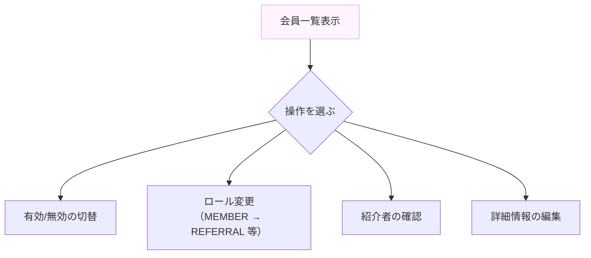

| 項目 | 説明 |
|------|------|
| 有効/無効 | 無効にすると会員はログインできなくなる |
| ロール変更 | MEMBER → REFERRAL / PARTNER への昇格など |
| 紹介者確認 | その会員を紹介したアンバサダーを表示 |

### 5.4 紹介管理

アンバサダーが紹介した会員と報酬を管理します。

| 表示内容 | 説明 |
|----------|------|
| 紹介者名 | どのアンバサダーが紹介したか |
| 被紹介者名 | 紹介された会員 |
| 紹介日 | いつ紹介が成立したか |
| 報酬計算 | 紹介人数 × 単価（設定画面で変更可） |

### 5.5 問い合わせ管理

一般公開のお問い合わせフォームから届いた内容を管理します。

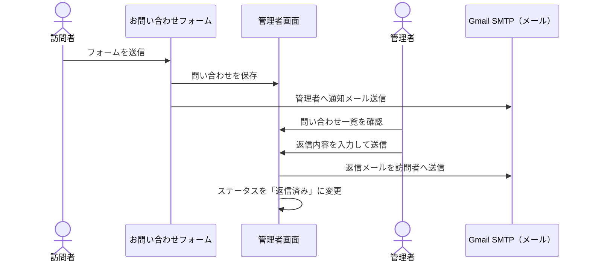

| ステータス | 意味 |
|----------|------|
| 未対応 | まだ確認・返信していない |
| 対応中 | 担当者が確認・検討している |
| 返信済み | 返信が完了している |

### 5.6 コンテンツ管理

| コンテンツ | 編集できる内容 |
|----------|--------------|
| 今日のテーマ | 日付・テーマ文章 |
| ジャーナリングテーマ | 日付・テーマ文章 |
| アーカイブ動画 | タイトル・動画URL・カテゴリ・タグ・公開日 |

### 5.7 イベント管理

| 項目 | 説明 |
|------|------|
| イベント作成 | タイトル・日時・説明・Zoomリンクを登録 |
| 参加者一覧 | 誰が申込したか一覧で確認 |
| 定員設定 | 最大参加人数を設定（任意） |

### 5.8 LP設定（ランディングページ設定）

ランディングページ（サービス紹介ページ）の内容を管理画面から直接編集できます。プログラムの知識は不要です。

**編集できるセクション**

| セクション | 編集内容 |
|----------|---------|
| ファーストビュー | キャッチコピー・背景画像・サブテキスト |
| コンセプト | 見出し・説明文・画像 |
| お試し動画 | 動画の埋め込みURL・説明文 |
| 活動内容 | ブロックごとにタイトル・説明・画像を設定 |
| 口コミ | 参加者名・本文・アバター画像 |
| CTA（行動促進） | 「今すぐ始める」ボタン + 「ログイン」ボタンの2ボタン |

> **CTA（Call To Action）とは？**
> 訪問者に行動を促すボタンやリンクのことです。「今すぐ始める」「無料で試す」などがCTAの例です。

### 5.9 チャット管理

| 操作 | 説明 |
|------|------|
| チャンネル作成 | 新しいテーマ別の部屋を作る |
| アクセス権設定 | どのロールがそのチャンネルを見られるか設定 |
| チャンネル削除 | 不要になったチャンネルを削除 |

**アクセス権の例**

| チャンネル名 | 閲覧できるロール |
|------------|---------------|
| # 全員の広場 | MEMBER・REFERRAL・PARTNER |
| # アンバサダー専用 | REFERRAL・PARTNER |
| # 運営連絡 | ADMIN |

### 5.10 外部サービス設定

管理画面から以下の設定を変更できます（プログラムを触らなくてよい）。

| 設定項目 | 説明 |
|---------|------|
| UnivaPay API キー | 決済サービスの接続情報 |
| Lark 接続設定 | Lark Base との連携情報 |
| 紹介報酬単価 | 1件の紹介につき支払う報酬額 |

---

## 6. 公開ページ（ログイン不要）

ログインしていない訪問者が閲覧・利用できるページです。

| ページ | 概要 |
|--------|------|
| LP（ランディングページ） | サービス紹介・お試し動画・「今すぐ始める」CTA |
| お問い合わせ | 一般向けお問い合わせフォーム（送信時に管理者へメール通知） |
| 会員登録 | UnivaPay 決済フォーム経由で会員登録 |
| ログイン | メール＋パスワードによる認証 |
| 招待リンク経由登録 | 管理者から届いた招待 URL から会員登録 |

### 6.1 会員登録の流れ

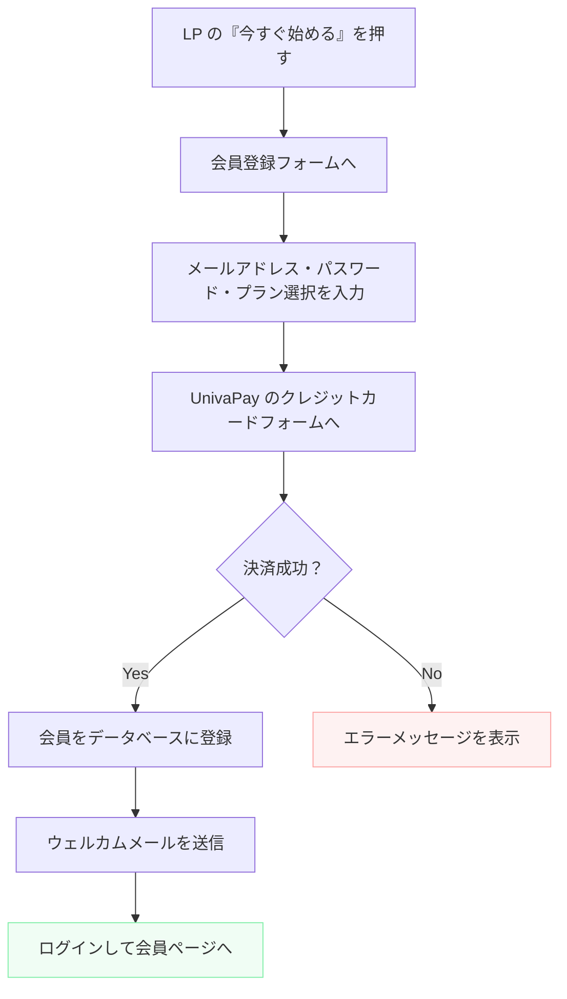

### 6.2 招待リンク経由の登録

管理者が特定の人を招待したいとき、招待リンクを生成してメールで送ります。

- 招待リンクは **72時間** 有効
- リンクからアクセスすると専用の登録フォームが表示される
- 通常の決済フォームをスキップして登録できる（管理者が手動で決済を処理する場合）

---

## 7. データモデル（情報の設計図）

> **データモデルとは？**
> サービスが扱う情報をどのように整理・保存するかを示す設計図です。
> 「どんな情報のまとまりがあって、それぞれがどう関係しているか」を表しています。

### 7.1 主要テーブル一覧

| テーブル名 | 何を保存するか |
|-----------|--------------|
| User | 会員情報（メール・パスワード・ロール・アンバサダー種別・紹介者） |
| ChatChannel | チャットの「部屋」情報（名前・アクセス権） |
| ChatMessage | チャットの各メッセージ（本文・投稿者・スレッド） |
| InviteToken | 招待リンクのトークン（72時間有効） |
| EventRegistration | イベントへの参加申込記録 |
| Setting | 管理画面で変更できる設定値（UnivaPay・Lark・報酬単価等） |
| ContactInquiry | お問い合わせ（氏名・メール・本文・ステータス） |
| InquiryReply | 問い合わせへの返信内容 |
| UnivaPayEvent | 決済Webhookの受信ログ（二重処理防止のため） |

> **Webhook（ウェブフック）とは？**
> 何かイベント（例：決済完了）が起きたとき、外部サービスが自動的にこちらのサーバーに通知を送る仕組みです。

### 7.2 主要な関係図（ER図）

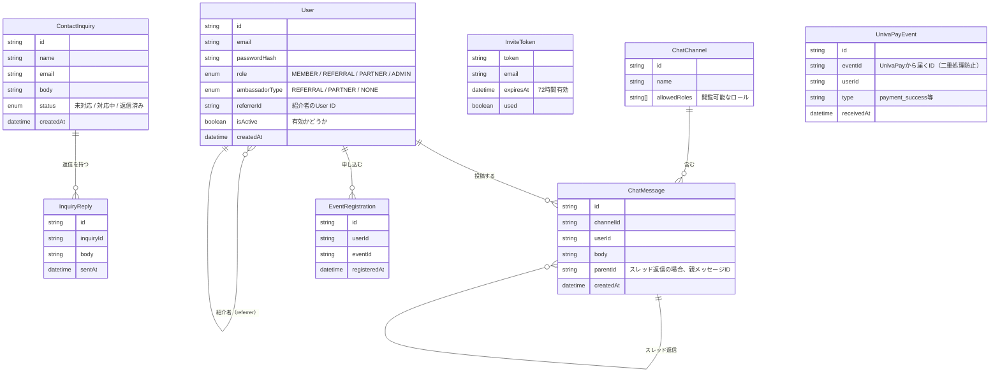

---

## 8. 技術選定

> **「なぜその技術を選んだか」も一緒に説明します。**
> 技術の名前だけ見ても分かりにくいので、「どんな役割を果たすか」を中心に読んでください。

### 8.1 技術スタック全体図

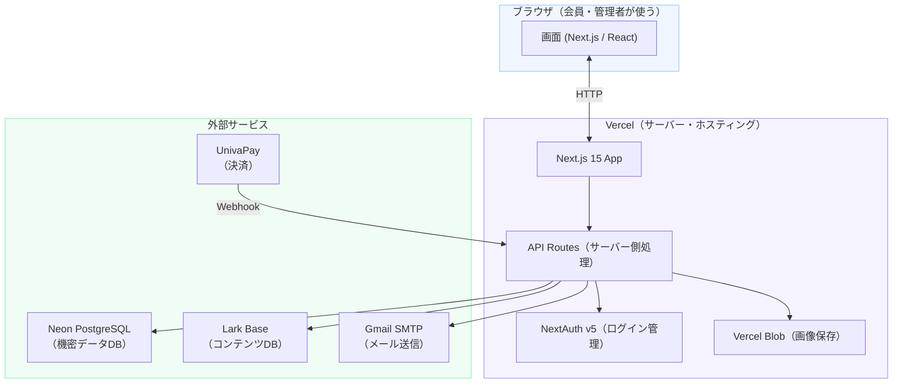

### 8.2 各技術の詳細

#### フロントエンド・バックエンド（画面と裏側の処理）

| 技術 | 役割 | なぜ選んだか |
|------|------|------------|
| **Next.js 15（App Router）** | 画面（フロント）とサーバー側処理（バック）を一つのプロジェクトで管理 | フロントとバックを別々に作らなくて済み、開発効率が高い。Vercel との相性も抜群 |
| **TypeScript** | プログラムの言語（JavaScript に型安全性を追加したもの） | タイプミスや型の間違いをコードを書いた段階で検出できるため、バグが減る |
| **Tailwind CSS** | デザインをコードで素早く書けるCSSフレームワーク（見た目の設計ツール） | クラス名を書くだけでデザインできるため、CSS を別ファイルで管理する必要がなく速い |

#### データベース（情報の保管場所）

| 技術 | 役割 | なぜ選んだか |
|------|------|------------|
| **Neon（PostgreSQL）** | クラウド上のデータベース。会員情報・チャット・イベント申込など機密性の高いデータを保存 | サーバーレス（使った分だけの課金）で、スケールが容易。PostgreSQL 互換で信頼性が高い |
| **Lark Base（飞书）** | ノーコードのデータベース。アーカイブ動画・今日のテーマなど非機密コンテンツを管理 | 非エンジニアでも画面上で直接データを編集できる。コンテンツ担当者がプログラム不要で更新できる |

> **ノーコード（No-Code）とは？**
> プログラムを書かずに、Excelのような感覚でデータを管理できるツールのことです。

#### 認証（ログイン管理）

| 技術 | 役割 | なぜ選んだか |
|------|------|------------|
| **NextAuth v5** | ログイン・ログアウト・セッション（ログイン状態の維持）を管理するライブラリ | Next.js との統合が簡単で、JWT（ログイン情報を暗号化したトークン）管理が自動化される |

- セッション有効期間: **30日間**（30日ごとに再ログインが必要）
- 認証方式: メールアドレス＋パスワード

#### 決済

| 技術 | 役割 | なぜ選んだか |
|------|------|------------|
| **UnivaPay** | 日本向けサブスクリプション（月額課金）決済サービス | 日本語対応・日本円のサブスクリプションに対応。Webhook で決済完了を自動通知できる |

#### ファイル・画像保存

| 技術 | 役割 | なぜ選んだか |
|------|------|------------|
| **Vercel Blob** | 管理者がアップロードした画像をクラウドに保存し、公開URLで参照 | Vercel と同じサービス内で完結するため、設定が簡単。管理者のみアップロード可能に制限 |

#### メール送信

| 技術 | 役割 | なぜ選んだか |
|------|------|------------|
| **Gmail SMTP（nodemailer）** | 招待メール・ウェルカムメール・問い合わせ返信を自動送信 | 追加コスト不要で使い始められる。初期規模（数十〜数百通/月）では十分 |

#### ホスティング（サービスの公開場所）

| 技術 | 役割 | なぜ選んだか |
|------|------|------------|
| **Vercel** | Next.js アプリケーションを世界中から閲覧できるよう公開・管理 | Next.js の開発元が提供するため互換性が最高。GitHubにコードをpushするだけで自動デプロイされる |

> **デプロイ（Deploy）とは？**
> 作ったプログラムをインターネット上で使えるように公開する作業のことです。

---

## 9. セキュリティ

会員の大切な情報を守るための仕組みです。

### 9.1 セキュリティ対策一覧

| 対象 | 対策 | 詳細 |
|------|------|------|
| パスワード | bcrypt（暗号化）でハッシュ化 | パスワードは平文（そのままの文字）では保存しない。万が一データが漏れても解読できない |
| ログイン試行 | レートリミット（試行回数制限） | 5回連続で失敗すると15分間ロック |
| 画像アップロード | ADMIN権限チェック＋ファイル種別チェック＋サイズ制限 | 悪意あるファイルのアップロードを防ぐ。上限10MB |
| 管理画面 | role=ADMIN かつ isActive=true の場合のみアクセス可 | 無効化された管理者アカウントは使えない |
| セッション | JWT（30日有効）＋ HttpOnly Cookie | セッション情報をJavaScriptから読めない形式で保存 |
| API | サーバーサイドでロール確認 | 画面上のボタンを非表示にするだけでなく、サーバー側でも必ず権限を確認 |

> **ハッシュ化（Hashing）とは？**
> 文字列を一定のアルゴリズムで変換して、元に戻せない形にすることです。「abc123」というパスワードは「$2b$10$xxx...」のような文字列に変換されて保存されます。

### 9.2 ログイン失敗時の挙動

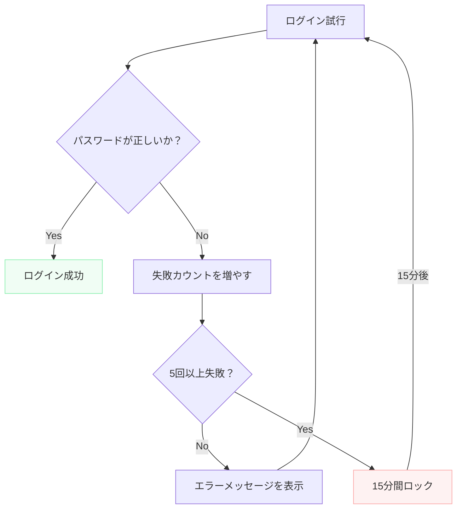

---

## 10. 非機能要件

### 10.1 パフォーマンス（速度）

| 指標 | 目標値 |
|------|--------|
| FCP（First Contentful Paint：最初の表示が出るまでの時間） | 1.8秒以内 |
| LCP（Largest Contentful Paint：主要コンテンツが表示されるまでの時間） | 2.5秒以内 |
| CLS（Cumulative Layout Shift：レイアウトのズレ） | 0.1以下 |
| Lighthouse Performance スコア | 90点以上 |

### 10.2 アクセシビリティ（使いやすさ）

> **アクセシビリティ（Accessibility）とは？**
> 高齢者・障害のある方・スクリーンリーダーを使う方なども含め、誰でも使いやすいよう設計することです。

| 項目 | 基準 |
|------|------|
| WCAG 準拠レベル | AA（国際的なアクセシビリティ標準の中程度レベル） |
| 色のコントラスト比 | 4.5:1 以上（背景と文字の明暗差） |
| タッチターゲットサイズ | 44px 以上（スマートフォンで押しやすいサイズ） |
| Lighthouse Accessibility スコア | 100点 |

### 10.3 対応デバイス・ブラウザ

| 項目 | 対応範囲 |
|------|---------|
| デバイス | スマートフォン・タブレット・PC |
| ブラウザ | Chrome・Safari・Firefox・Edge（最新版） |
| レスポンシブ対応 | あり（モバイルファースト設計） |

> **レスポンシブ（Responsive）とは？**
> 画面の大きさに応じて自動的にレイアウトが変わる設計のことです。スマホでもPCでも最適な表示になります。

### 10.4 可用性（使える状態を維持すること）

| 項目 | 目標 |
|------|------|
| 稼働率 | 99.9%以上（Vercel のSLAに準拠） |
| バックアップ | Neon の自動バックアップ（毎日） |
| 障害時の連絡先 | 管理者メールへ自動通知 |

### 10.5 スケーラビリティ（会員数が増えたときの対応）

| フェーズ | 会員数 | 対応方針 |
|---------|--------|---------|
| 初期 | 〜150名 | Vercel Free / Hobby プランで対応可能 |
| 成長期 | 〜1,000名 | Vercel Pro プランへ移行 |
| 大規模 | 3,000〜5,000名 | Neon のスケールアップ・Vercel Enterprise 検討 |

---

## 付録：用語集

| 用語 | 意味 |
|------|------|
| API（エーピーアイ） | アプリケーション同士が情報をやり取りするための仕組み |
| JWT（ジェイダブリュティー） | ログイン情報を安全に受け渡すための暗号化されたトークン |
| Webhook（ウェブフック） | 外部サービスが自動的にこちらへ通知を送る仕組み |
| デプロイ | プログラムをインターネット上で使えるよう公開する作業 |
| ハッシュ化 | 文字列を元に戻せない形に変換する処理 |
| レートリミット | 一定時間内の操作回数を制限する仕組み |
| セッション | ログイン後に「この人はログイン済み」と記憶しておく仕組み |
| ノーコード | プログラムを書かずに操作できるツール・サービス |
| レスポンシブ | 画面サイズに応じてレイアウトが自動調整される設計 |
| アクセシビリティ | 誰でも使いやすいよう設計すること |
| WCAG | Web アクセシビリティの国際標準ガイドライン |
| CTA | 訪問者に行動を促すボタン・リンク（「今すぐ始める」等） |
| ER図 | データの構造と関係を表した設計図 |
| Mermaid | テキストでフローチャートや図を書けるツール |

---

*Living Me 機能要件定義書 v2.0 — 最終更新: 2026-03-30*
