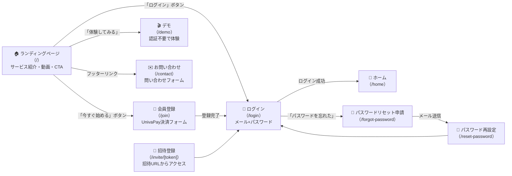
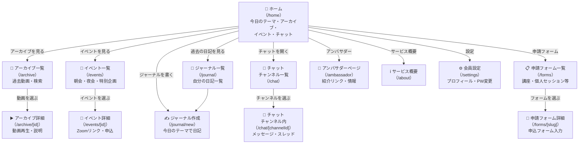
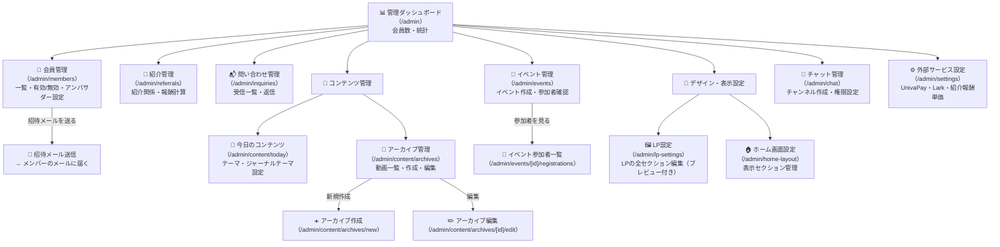
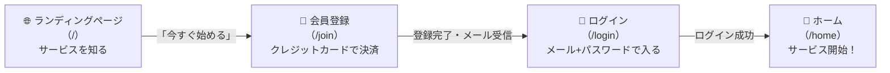
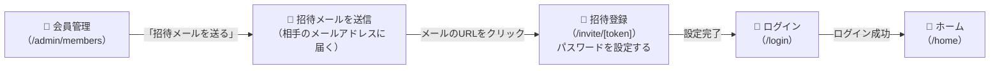
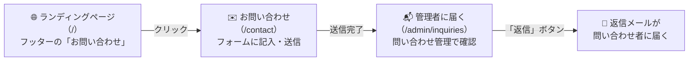

# 画面フロー図（サイトマップ）

**最終更新: 2026-03-30**
**対象読者: 初心者・非エンジニア**

---

このドキュメントは「どの画面からどの画面に移動できるか」を図と文章でわかりやすく説明します。
矢印（→）は「この画面からあの画面に移動できる」ことを表しています。

---

## 1. サイト全体マップ

サイト全体の画面は大きく3つのグループに分かれています。

```mermaid
flowchart TD
    subgraph PUBLIC["🌐 公開ページ（誰でも見られる）"]
        LP["/ ランディングページ"]
        CONTACT["/contact お問い合わせ"]
        JOIN["/join 会員登録"]
        LOGIN["/login ログイン"]
        INVITE["/invite/[token] 招待登録"]
        FORGOT["/forgot-password パスワードリセット申請"]
        RESET["/reset-password パスワード再設定"]
        DEMO["/demo デモ"]
    end

    subgraph MEMBER["🔒 会員ページ（ログイン後・有料会員のみ）"]
        HOME["/home ホーム"]
        ARCHIVE["/archive アーカイブ一覧"]
        ARCHIVE_D["/archive/[id] アーカイブ詳細"]
        EVENTS["/events イベント一覧"]
        EVENTS_D["/events/[id] イベント詳細"]
        JOURNAL["/journal ジャーナル一覧"]
        JOURNAL_NEW["/journal/new ジャーナル作成"]
        CHAT["/chat チャンネル一覧"]
        CHAT_CH["/chat/[channelId] チャット"]
        FORMS["/forms 申請フォーム一覧"]
        FORMS_D["/forms/[slug] 申請フォーム詳細"]
        AMBASSADOR["/ambassador アンバサダー"]
        ABOUT["/about サービス概要"]
        SETTINGS["/settings 会員設定"]
    end

    subgraph ADMIN["🔑 管理画面（管理者のみ）"]
        ADMIN_TOP["/admin ダッシュボード"]
        ADMIN_MEMBERS["/admin/members 会員管理"]
        ADMIN_REFERRALS["/admin/referrals 紹介管理"]
        ADMIN_INQUIRIES["/admin/inquiries 問い合わせ管理"]
        ADMIN_TODAY["/admin/content/today 今日のコンテンツ"]
        ADMIN_ARCHIVES["/admin/content/archives アーカイブ管理"]
        ADMIN_EVENTS["/admin/events イベント管理"]
        ADMIN_LP["/admin/lp-settings LP設定"]
        ADMIN_HLAYOUT["/admin/home-layout ホーム画面設定"]
        ADMIN_CHAT["/admin/chat チャット管理"]
        ADMIN_SETTINGS["/admin/settings 外部サービス設定"]
    end

    LP --> JOIN
    LP --> LOGIN
    LP --> DEMO
    LP --> CONTACT
    JOIN --> LOGIN
    INVITE --> LOGIN
    FORGOT --> RESET
    RESET --> LOGIN
    LOGIN --> HOME
    LOGIN --> ADMIN_TOP

    HOME --> ARCHIVE
    HOME --> EVENTS
    HOME --> JOURNAL_NEW
    HOME --> CHAT
```

---

## 2. アクセス権限のルール

画面によって「誰が見られるか」が決まっています。

| マーク | 意味 |
|--------|------|
| 🌐 | 誰でも見られる（ログイン不要） |
| 🔒 | ログイン済み＋有料会員のみ |
| 🔑 | 管理者（スタッフ）のみ |

**もし権限のないページを開こうとすると...**
- 未ログインの場合 → `/login` にリダイレクト
- アカウント停止中 → `/login?error=suspended` にリダイレクト
- 管理者でない場合 → アクセス拒否

---

## 3. 公開ページの画面遷移

ログインしていない人でも見られる画面です。

### 各画面の説明

| 画面 | 目的 | 主なボタン・リンク |
|------|------|-------------------|
| ランディングページ（/） | サービスを知ってもらう | 会員登録・ログイン・デモ体験 |
| お問い合わせ（/contact） | 非会員からの質問を受け付ける | 送信ボタン |
| 会員登録（/join） | 新規会員を受け付ける（有料） | 決済フォーム |
| ログイン（/login） | 既存会員がサインイン | ログインボタン・パスワード忘れリンク |
| 招待登録（/invite/[token]） | 管理者が招待した人が登録する | パスワード設定フォーム |
| パスワードリセット申請（/forgot-password） | パスワードを忘れた場合 | メール送信ボタン |
| パスワード再設定（/reset-password） | メールのリンクから新しいパスワードを設定 | 再設定ボタン |
| デモ（/demo） | 会員登録前にサービスを体験できる | - |

---

## 4. 会員ページの画面遷移

ログイン後、有料会員が使えるページです。

### 各画面の説明

| 画面 | 目的 |
|------|------|
| ホーム（/home） | 今日のテーマ・動画・イベント・チャットの入り口 |
| アーカイブ一覧（/archive） | 過去の動画をカテゴリ・タグで探す |
| アーカイブ詳細（/archive/[id]） | 動画を再生して内容を確認する |
| イベント一覧（/events） | 朝会・夜会・特別企画の予定を確認する |
| イベント詳細（/events/[id]） | ZoomリンクやGoogleカレンダーへの追加、申込フォーム |
| ジャーナル一覧（/journal） | 自分が書いた日記の一覧を見る |
| ジャーナル作成（/journal/new） | 今日のテーマに沿って日記を書く |
| チャット チャンネル一覧（/chat） | 参加できるチャンネルの一覧 |
| チャット チャンネル内（/chat/[channelId]） | チャンネルでメッセージを送受信する |
| 申請フォーム一覧（/forms） | 講座や個人セッションの申込フォーム一覧 |
| 申請フォーム詳細（/forms/[slug]） | 申込フォームに入力・送信する |
| アンバサダー（/ambassador） | 自分の紹介リンクを確認・シェアする |
| サービス概要（/about） | サービスの説明を読む |
| 会員設定（/settings） | プロフィールやパスワードを変更する |

---

## 5. 管理画面の画面遷移

管理者（スタッフ）だけが使えるページです。

### 各画面の説明

| 画面 | 目的 |
|------|------|
| 管理ダッシュボード（/admin） | 会員数や売上などの統計を一目で確認 |
| 会員管理（/admin/members） | 会員の有効/無効切替・アンバサダー種別の設定・招待メール送信 |
| 紹介管理（/admin/referrals） | 誰が誰を紹介したか・紹介報酬の計算を確認 |
| 問い合わせ管理（/admin/inquiries） | /contact から届いた問い合わせを確認・返信 |
| 今日のコンテンツ（/admin/content/today） | 今日のテーマやジャーナリングテーマを設定 |
| アーカイブ管理（/admin/content/archives） | 過去動画の一覧・新規追加・編集・削除 |
| アーカイブ作成（/admin/content/archives/new） | 新しい動画コンテンツを登録する |
| アーカイブ編集（/admin/content/archives/[id]/edit） | 既存の動画情報を修正する |
| イベント管理（/admin/events） | 朝会・夜会などのイベントを作成・管理 |
| イベント参加者一覧（/admin/events/[id]/registrations） | 特定イベントへの申込者を確認 |
| LP設定（/admin/lp-settings） | ランディングページの文章・画像・レイアウトを編集（プレビュー付き） |
| ホーム画面設定（/admin/home-layout） | 会員ホーム画面に表示するセクションを管理 |
| チャット管理（/admin/chat） | チャンネルの作成・権限設定 |
| 外部サービス設定（/admin/settings） | UnivaPay（決済）・Lark（グループウェア）・紹介報酬単価の設定 |

---

## 6. 主要なユーザー動線

よく使われる「画面の流れ」を3つ紹介します。

### 6-1. 新規会員が入会するまでの流れ

**手順をかんたんに言うと:**
1. LP でサービスを知る
2. 「今すぐ始める」ボタンをクリック
3. `/join` でクレジットカード決済 → アカウント作成 → 確認メールが届く
4. `/login` でログイン → `/home` でサービス開始

---

### 6-2. 管理者が新しいメンバーを招待する流れ

**手順をかんたんに言うと:**
1. 管理者が `/admin/members` で「招待メールを送る」
2. 招待された人のメールに URL が届く
3. `/invite/[token]` でパスワードを設定
4. `/login` でログイン → サービス開始

---

### 6-3. 非会員がお問い合わせする流れ

**手順をかんたんに言うと:**
1. LP フッターの「お問い合わせ」をクリック
2. `/contact` でフォームに記入・送信
3. 管理者が `/admin/inquiries` で内容を確認
4. 管理者が返信 → 問い合わせ者にメールが届く

---

## 7. 画面一覧（まとめ）

### 公開ページ（誰でも見られる）

| URL | 画面名 | 説明 |
|-----|--------|------|
| `/` | ランディングページ（LP） | サービス紹介・お試し動画・「今すぐ始める」ボタン |
| `/contact` | お問い合わせ | 非会員向けの問い合わせフォーム |
| `/join` | 会員登録 | UnivaPay決済フォームで入会手続き |
| `/login` | ログイン | メールアドレス＋パスワードで認証 |
| `/invite/[token]` | 招待登録 | 管理者からの招待メールURLで登録 |
| `/forgot-password` | パスワードリセット申請 | パスワードを忘れたときにメール送信 |
| `/reset-password` | パスワード再設定 | メールのリンクから新しいパスワードを設定 |
| `/demo` | デモ | 登録前にサービスを体験できるデモページ |

### 会員ページ（ログイン後・有料会員のみ）

| URL | 画面名 | 説明 |
|-----|--------|------|
| `/home` | ホーム | 今日のテーマ・アーカイブ・イベント・チャットの入り口 |
| `/archive` | アーカイブ一覧 | 過去動画をカテゴリ・タグで検索 |
| `/archive/[id]` | アーカイブ詳細 | 動画再生・説明テキスト |
| `/events` | イベント一覧 | 朝会・夜会・特別企画の予定一覧 |
| `/events/[id]` | イベント詳細 | Zoomリンク・申込フォーム |
| `/journal` | ジャーナル一覧 | 自分が書いた日記の一覧 |
| `/journal/new` | ジャーナル作成 | 今日のテーマに沿って日記を書く |
| `/chat` | チャット（チャンネル一覧） | 参加できるチャンネルを選ぶ |
| `/chat/[channelId]` | チャット（チャンネル内） | メッセージ・スレッドを見て送受信する |
| `/forms` | 申請フォーム一覧 | マヤ暦講座・個人セッション等の申込フォーム一覧 |
| `/forms/[slug]` | 申請フォーム詳細 | 申込フォームに入力・送信 |
| `/ambassador` | アンバサダーページ | 自分の紹介リンクを確認・シェア |
| `/about` | サービス概要 | サービスの詳しい説明ページ |
| `/settings` | 会員設定 | プロフィール・パスワード変更 |

### 管理画面（管理者のみ）

| URL | 画面名 | 説明 |
|-----|--------|------|
| `/admin` | 管理ダッシュボード | 会員数・統計のまとめ |
| `/admin/members` | 会員管理 | 会員の一覧・有効/無効・アンバサダー種別設定・招待 |
| `/admin/referrals` | 紹介管理 | 紹介関係・報酬計算 |
| `/admin/inquiries` | 問い合わせ管理 | /contact から届いた問い合わせの確認・返信 |
| `/admin/content/today` | 今日のコンテンツ | 今日のテーマ・ジャーナリングテーマの設定 |
| `/admin/content/archives` | アーカイブ管理 | 動画一覧・作成・編集・削除 |
| `/admin/content/archives/new` | アーカイブ作成 | 新しい動画コンテンツを追加 |
| `/admin/content/archives/[id]/edit` | アーカイブ編集 | 既存の動画情報を編集 |
| `/admin/events` | イベント管理 | イベントの作成・参加者確認 |
| `/admin/events/[id]/registrations` | イベント参加者一覧 | 特定イベントの申込者一覧 |
| `/admin/lp-settings` | LP設定 | LPの全セクション編集（プレビュー付き） |
| `/admin/home-layout` | ホーム画面設定 | 会員ホームの表示セクション管理 |
| `/admin/chat` | チャット管理 | チャンネル作成・権限設定 |
| `/admin/settings` | 外部サービス設定 | UnivaPay・Lark・紹介報酬単価の設定 |

---

*このドキュメントはシステムの画面構成を非エンジニアにわかりやすく伝えることを目的としています。*
*実装の詳細については開発チームにお問い合わせください。*
